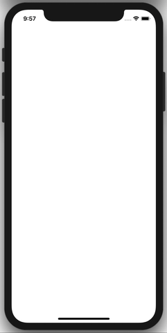

# Ottonova Coding Challenge

This is the Ottonova Coding Challenge about retrieving a profile and presenting health prompts and timeline events.

## External Frameworks
The only external framework used is [APIClient](https://github.com/diegotl/APIClient), which was made by myself and is open sourced. It's just a lightweight API Client.

## Architectures
### MVP
For high level layers, MVP pattern was used, decoupling view and presentation logic, making views more reusable. Both are referenced by each other's protocol, not concrete type, improving testability.
The Configurators are simple dependency injection objects.
Routers contains the view instantiation logic. They provide a way to reach it's belonging scene.

### Clean Architecture
Use Cases objects implements the logic for a specific use case. They are referenced by the presenters and communicate with Gateways. Entities are manipulated by Use Cases and are sent to/retrieved by the Gateways.

## Tests
Tests were written for Extensions and for the LoadingProfilePresenter, checking it's behaviour for all possible scenarios.
